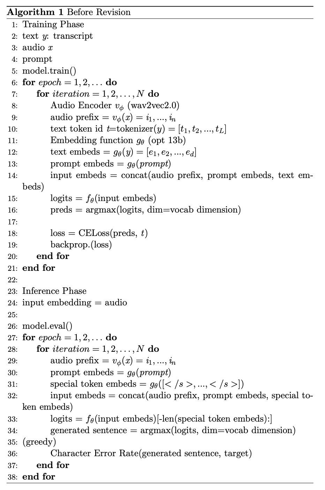

# Introduction
- paper: 
- model reference: https://github.com/jason9693/FROZEN

Frozen은 image와 text를 입력값으로 받는 멀티모달 모델이다.<br>
Large Language Model의 향상된 성능을 활용하여 여러가지 task(few-shot)를 처리할 수 있는 멀티모달 시스템을 고안한다.<br>
기존의 pretrain-finetune 스타일은 특정 task에 대해 높은 성능을 얻을 수 있었지만, task 마다 별도의 모델을 설계해야 했으며 완성된 finetuned model의 copy를 모두 저장해야하므로 resource에 대한 부담이 컸다.<br>
Frozen 모델은 Prefix-tuning(https://arxiv.org/abs/2101.00190)의 학습 방법을 멀티모달에 적용했다.<br>
먼저 이미지 인코더로부터 이미지에 대한 feature를 얻는다. 이 이미지를 Language model의 embedding vector와 동일한 차원의 벡터 n개로 압축해 vision prefix를 얻는다.<br>
정답이 될 text caption은 tokenizing과 text embedding을 거친 후 vision prefix와 이어붙여진다.<br>
학습 이후 inference에서는 demonstrations(optional), vision prefix, prompt를 concat하여 input embedding으로 사용한다.<br>
prompt는 task에 대한 정보를 주는 지시문이다. <br>예를 들어 자동차 이미지가 주어진다면, vision encoder에서 이미지를 임베딩 벡터화 하고 prompt로는 "이 그림 안에 어떤 물체가 있니?"와 같은 prompt를 제시할 수 있다.
<br> demonstration은 few-shot learning을 위해 제공하는 예시의 수 이다. 만약 one-shot learning이라면 앞선 자동차 이미지 예시를 수행하기 위해 자전거 이미지의 예시와 정답을 동일한 input 형태로 앞에 붙여주는 것이다. 

## Algorithm
pseudo code



# Installation
- Requirements:
  - pytorch_lightning
  - transformers 
  - Pillow==8.2.0
  - tqdm==4.56.0
  - ipdb==0.13.4
  - numpy==1.19.5
  - einops==0.3.0
  - pyarrow==2.0.0
  - sacred==0.8.2
  - pandas==1.1.5
  - timm
  - streamlit
  - sentencepiece
  - omegaconf
  - torchtext==0.9.1

- Environment
  - os: ubuntu 18.04
  - cpu: 
  - gpu: 
  - system ram: 


# Run
기본폴더로 이동
```
>> cd FROZEN
```
## Train
```
# Download datasets
# 1. COCO datset
>> bash script/coco_download.sh

# 2. VqaV2 dataset
>> bash script/vqav2_download.sh
```
```
# 3. make arrow dataset
from frozen import make_arrow
make_arrow("./dataset/coco/", "./dataset/coco/arrows/")
```

```
# 4. train
>> python train.py with data_root=$ARROW_DATA_PATH num_gpus=$N_GPUS num_nodes=$NUM_NODES $TASK_NAME per_gpu_batchsize=$BATCH_SIZE load_path="$CKPT_PATH"
```
### Argument
1. data_root
2. num_gpus
3. num_nodes
4. per_gpu_batchsize
5. load_path

## Inference

```
from frozen import FrozenModel

frozen = FrozenModel.from_pretrained("gpt2")
output = frozen(img, tokens)
```