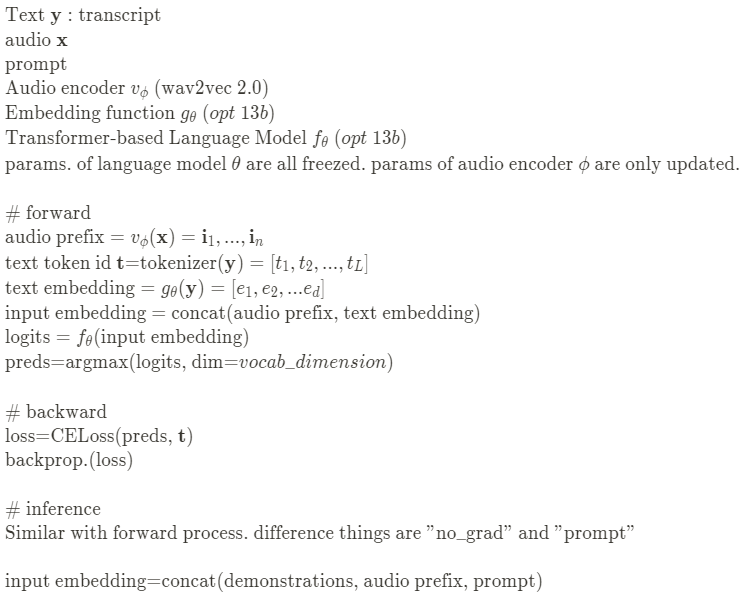

# Introduction 
- 현재 연구 중인 모델입니다.

Frozen은 audio와 text를 입력값으로 받는 멀티모달 모델이다.<br>
Large Language Model의 향상된 성능을 활용하여 여러가지 task(few-shot)를 처리할 수 있는 멀티모달 시스템을 고안한다.<br>
기존의 pretrain-finetune 스타일은 특정 task에 대해 높은 성능을 얻을 수 있었지만, task 마다 별도의 모델을 설계해야 했으며 완성된 finetuned model의 copy를 모두 저장해야하므로 resource에 대한 부담이 컸다.<br>
연구 중인 FrozenTune의 배경이 된 Frozen 모델(https://arxiv.org/abs/2106.13884)과 WavPrompt 모델(https://www.isca-speech.org/archive/interspeech_2022/gao22e_interspeech.html)은 Prefix-tuning(https://arxiv.org/abs/2101.00190)의 학습 방법을 멀티모달에 적용했다.<br>
먼저 오디오 인코더로부터 오디오에 대한 feature를 얻는다. 이 이미지를 Language model의 embedding vector와 동일한 차원의 벡터 n개로 압축해 audio prefix를 얻는다.<br>
정답이 될 text transcript는 tokenizing과 text embedding을 거친 후 audio prefix와 이어붙여진다.<br>
학습 이후 inference에서는 demonstrations(optional), audio prefix, prompt를 concat하여 input embedding으로 사용한다.<br>
prompt는 task에 대한 정보를 주는 지시문이다. <br>예를 들어 음성인식용 오디오가 주어진다면, audio encoder에서 오디오를 임베딩 벡터화 하고 prompt로는 "그가 무슨 말을 했니?"와 같은 prompt를 제시할 수 있다.
<br> demonstration은 few-shot learning을 위해 제공하는 예시의 수 이다. 만약 one-shot learning이라면 앞선 음성인식 예시를 수행하기 위해 오디오 음성인식의 예시와 정답을 동일한 input 형태로 앞에 붙여주는 것이다. 

## Algorithm
pseudo code


# Installation
- Requirements: txt 참고

- Environment
  - os: ubuntu 18.04
  - gpu: A100 80GB
  - system ram: 64GB
  - conda 23.3.1


# Run
기본폴더로 이동

## Train
1. Download LibriSpeech Dataset 
   - dataset/librispeech.yaml 에서 dataset_path를 변경(train,test,dev는 자동으로 다운로드)
   - 데이터셋 디렉토리 구조
     - dataset_path
       - LibriSpeech
         - train-clean-360
         - dev-clean
         - test-clean

```
>> python train.py
```
